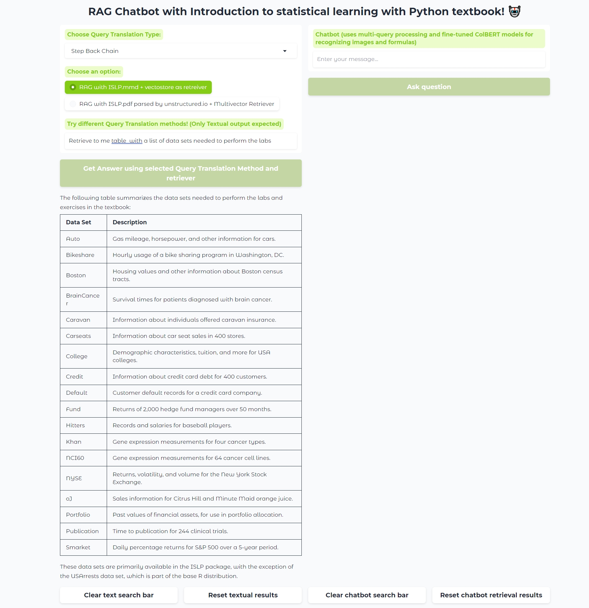
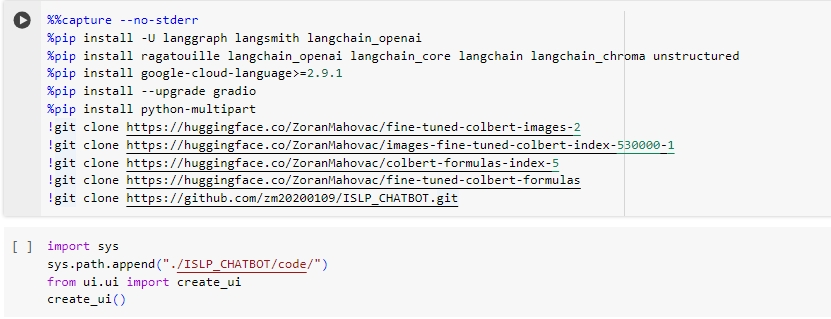
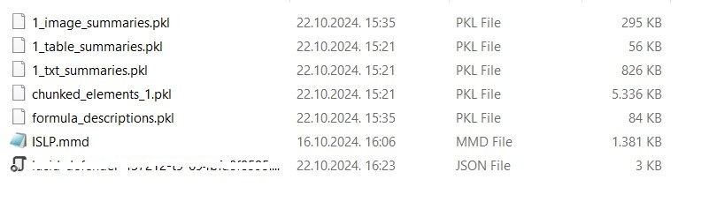

# ISLP RAG ChatBot App
For detail documentation of application, visit: [PDF doc](assets/ZavrsniFinal_20_11.pdf)

## Table of Contents
* [Description](#description)

* [Architecture](#architecture)

* [Setup](#setup)

- [Evaluation](#evaluation)

## Description
Chat with Introduction to statistical learning in Python textbook. 

In the first input field designated for the user query, the user can choose a retriever based on how the .pdf document has been parsed. 
This can be either a **nougat parser** or an **unstructured .pdf parser**. 
* If the user selects the nougat parser, a **vector store** is created as the retriever;
* if the unstructured parser is chosen, a **MultiVectorRetriever** is created.

The user can select a **method for transforming the original query** from five available options: 
1. Step Back
2. Multiquery
3. Recursive Decomposition
4. Query Decomposition (Individual Answers)
5. HyDE Chain.

In the **first input field**, the user can receive responses in the form of **text, tables, Python code, and formulas** from the selected book by pressing the button *"Get Answer using selected Query Translation Method and retriever."*
By asking a question **in the second input field**, the user query is transformed using the **Multi Query strategy**, and an instance of **MultiVectorRetriever** is employed; however, this time the user can also perform **image searches** besides mentioned operations.

This is an example of asking Chatbot for specific image:

This is an example of asking for specific formula:

This is an example of asking for partition of Python code.

This is an example of asking for table output:

## Architecture

## Setup

The application runs in Google Colab. It is necessary to import the .env file, as shown in the image, into the content/ directory, along with the data_dir/ directory, which contains all the data needed to run the application. 
Given that the book has many pages, chunks have been created and saved in .pkl variables.
.env file contains OPENAI_API_KEY, GOOGLE_CLOUD_KEY_FILE (all images are stored in the cloud bucket), LANGCHAIN_API_KEY, LANGCHAIN_TRACING_V2, LANGCHAIN_ENDPOINT, LANGCHAIN_PROJECT variables

data_dir/ content:

## Evaluation 

* Evaluation of Query translation methods
  
Evaluations of the metrics **mean context precision, mean context recall, mean faithfulness,** and **mean relevancy** were conducted using the **RAGAS** evaluation library. 
It was determined that the **Step Back approach** for decomposing user queries achieves the best results on the MultiVectorRetriever instance where the .pdf document was parsed 
using the **unstructured library**. The evaluation dataset was created manually.

| Chain Name                       | Mean Context Precision | Mean Context Recall | Mean Faithfulness | Mean Relevancy |
|----------------------------------|------------------------|---------------------|-------------------|-----------------|
| multiquery_chain                 | 0.9252                 | 0.7405              | 0.7355            | 0.7791          |
| decomposition_chain               | 0.9551                | 0.6842              | 0.4788            | 0.6779          |
| decomposition_individual_chain    | 0.9670                | 0.7164              | 0.7545            | 0.9063          |
| stepback_chain                   | 0.9435                 | 0.7120              | 0.8610            | 0.9254          |
| HyDE_chain                       | 0.9443                 | 0.7276              | 0.6085            | 0.8859          |

* Hyperparameters optimization for fine-tuned ColBERT for images retrieval (k is the number of retrieved documents).

### Recall@k for maxsteps during training Variations

| Max Steps | k=1     | k=3     | k=5     | k=10    | k=1     | k=3     | k=5     | k=10    |
|-----------|---------|---------|---------|---------|---------|---------|---------|---------|
|           | Training| Training| Training| Training| Test    | Test    | Test    | Test    |
| 510,000   | 0.68834 | 0.72812 | 0.77891 | 0.79972 | 0.58873 | 0.68234 | 0.76202 | 0.78832 |
| 525,000   | 0.75000 | 0.90816 | 0.95408 | 0.96939 | 0.64796 | 0.86735 | 0.92347 | 0.95918 |
| 530,000   | 0.75510 | 0.90816 | 0.96429 | 0.98469 | 0.67857 | 0.89796 | 0.94388 | 0.96939 |
| 540,000   | 0.73469 | 0.92347 | 0.93878 | 0.96939 | 0.67857 | 0.86735 | 0.88776 | 0.95408 |
| 550,000   | 0.71939 | 0.86735 | 0.93367 | 0.95918 | 0.63776 | 0.83673 | 0.89796 | 0.93367 |
| 600,000   | 0.70918 | 0.84694 | 0.91327 | 0.96429 | 0.62755 | 0.82143 | 0.87755 | 0.92857 |

### NDCG@k for maxsteps during training variations 

| Max Steps | k=1     | k=3     | k=5     | k=10    | k=1     | k=3     | k=5     | k=10    |
|-----------|---------|---------|---------|---------|---------|---------|---------|---------|
|           | Training| Training| Training| Training| Test    | Test    | Test    | Test    |
| 510,000   | 0.69848 | 0.77938 | 0.79483 | 0.80929 | 0.59834 | 0.70374 | 0.72936 | 0.75111 |
| 525,000   | 0.75000 | 0.84338 | 0.86735 | 0.86790 | 0.64796 | 0.77703 | 0.80030 | 0.81175 |
| 530,000   | 0.75510 | 0.84633 | 0.86938 | 0.87610 | 0.67857 | 0.81098 | 0.82986 | 0.83809 |
| 540,000   | 0.73469 | 0.84645 | 0.85282 | 0.86349 | 0.67857 | 0.78966 | 0.79823 | 0.82039 |
| 550,000   | 0.71939 | 0.80673 | 0.83395 | 0.84239 | 0.63776 | 0.75595 | 0.78075 | 0.79241 |
| 600,000   | 0.70918 | 0.79476 | 0.82176 | 0.83812 | 0.62755 | 0.74253 | 0.76513 | 0.78189 |

### NDCG@k for Learning Rate Variations

| Learning Rate | k=1     | k=3     | k=5     | k=10    | k=1     | k=3     | k=5     | k=10    |
|---------------|---------|---------|---------|---------|---------|---------|---------|---------|
|               | Training| Training| Training| Training| Test    | Test    | Test    | Test    |
| 5e-6          | 0.58673 | 0.73378 | 0.76320 | 0.77856 | 0.55612 | 0.70383 | 0.73083 | 0.75537 |
| 1e-5          | 0.70408 | 0.82294 | 0.84622 | 0.85146 | 0.63776 | 0.77126 | 0.79848 | 0.80885 |
| 2e-5          | 0.66837 | 0.79555 | 0.80806 | 0.82309 | 0.58673 | 0.69472 | 0.73074 | 0.75460 |
| 2.2e-5        | 0.68878 | 0.81541 | 0.83604 | 0.83913 | 0.60714 | 0.72843 | 0.76445 | 0.78263 |
| 2.6e-5        | 0.64286 | 0.78170 | 0.79883 | 0.81235 | 0.61224 | 0.73044 | 0.74318 | 0.76202 |

### Recall@k for Learning Rate Variations

| Learning Rate | k=1     | k=3     | k=5     | k=10    | k=1     | k=3     | k=5     | k=10    |
|---------------|---------|---------|---------|---------|---------|---------|---------|---------|
|               | Training| Training| Training| Training| Test    | Test    | Test    | Test    |
| 5e-6          | 0.58673 | 0.83673 | 0.90816 | 0.95408 | 0.55612 | 0.80612 | 0.87245 | 0.94898 |
| 1e-5          | 0.70408 | 0.90306 | 0.95918 | 0.97449 | 0.63776 | 0.86735 | 0.93367 | 0.96429 |
| 2e-5          | 0.66837 | 0.88265 | 0.91327 | 0.95918 | 0.58673 | 0.76531 | 0.85204 | 0.92347 |
| 2.2e-5        | 0.68878 | 0.89796 | 0.94898 | 0.95918 | 0.60714 | 0.81633 | 0.90306 | 0.95918 |
| 2.6e-5        | 0.64286 | 0.87245 | 0.91327 | 0.95408 | 0.61224 | 0.81122 | 0.84184 | 0.89796 |

### NDCG@k for Batch Size Variations

| Batch Size | k=1     | k=3     | k=5     | k=10    | k=1     | k=3     | k=5     | k=10    |
|------------|---------|---------|---------|---------|---------|---------|---------|---------|
|            | Training| Training| Training| Training| Test    | Test    | Test    | Test    |
| 4          | 0.7398  | 0.83102 | 0.84596 | 0.85465 | 0.64286 | 0.75917 | 0.78684 | 0.80030 |
| 6          | 0.67347 | 0.80387 | 0.82562 | 0.83236 | 0.60714 | 0.74520 | 0.77309 | 0.78846 |
| 16         | 0.66837 | 0.77690 | 0.80919 | 0.81982 | 0.60714 | 0.74909 | 0.77609 | 0.78917 |

### Recall@k for Batch Size Variations

| Batch Size | k=1     | k=3     | k=5     | k=10    | k=1     | k=3     | k=5     | k=10    |
|------------|---------|---------|---------|---------|---------|---------|---------|---------|
|            | Training| Training| Training| Training| Test    | Test    | Test    | Test    |
| 4          | 0.7398  | 0.89286 | 0.92857 | 0.95408 | 0.64286 | 0.83673 | 0.90306 | 0.94388 |
| 6          | 0.67347 | 0.89286 | 0.94388 | 0.96429 | 0.60714 | 0.84184 | 0.90816 | 0.95408 |
| 16         | 0.66837 | 0.75085 | 0.76922 | 0.77404 | 0.60714 | 0.84694 | 0.72993 | 0.95408 |

