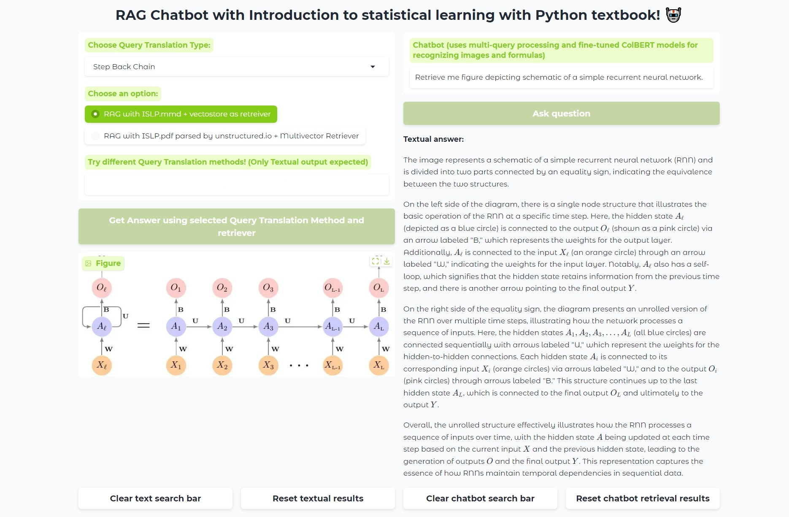
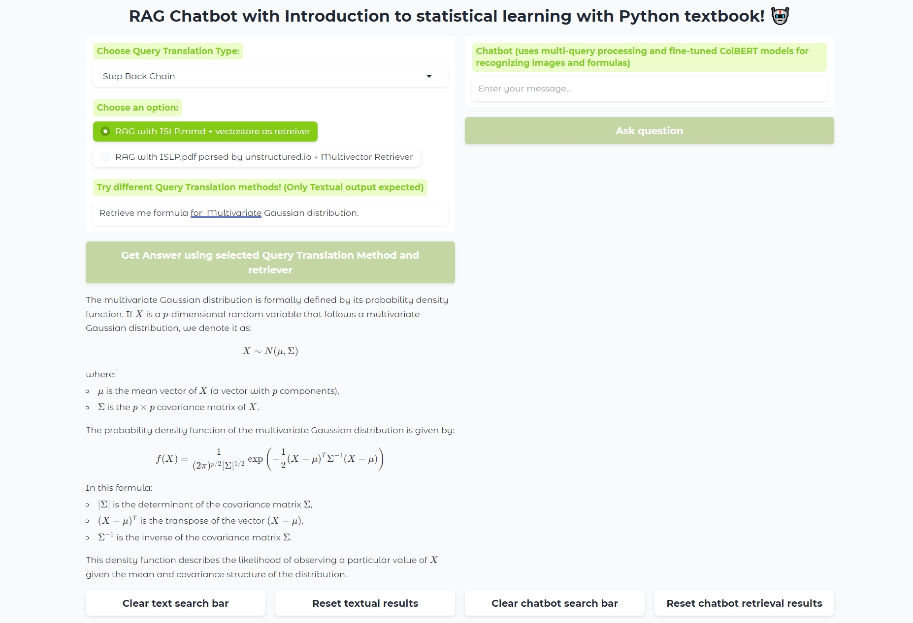
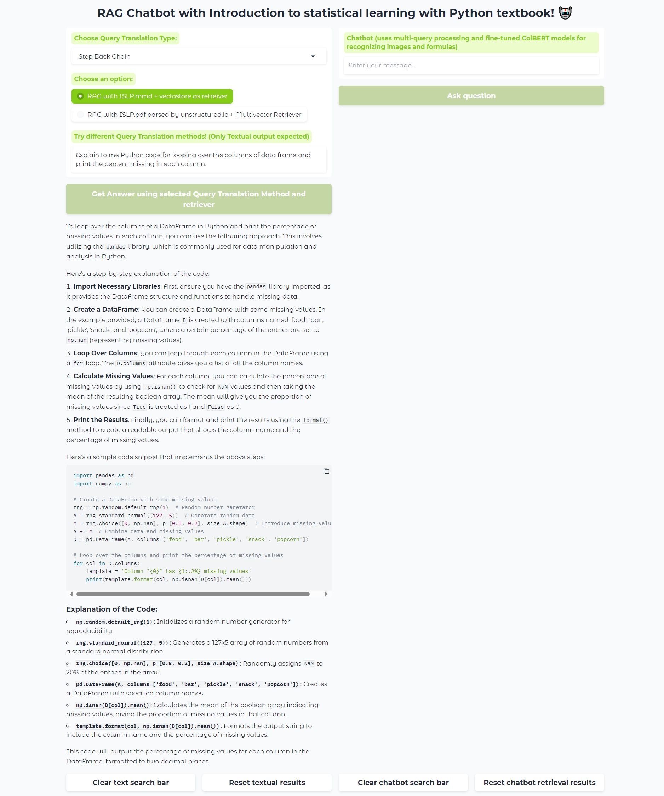
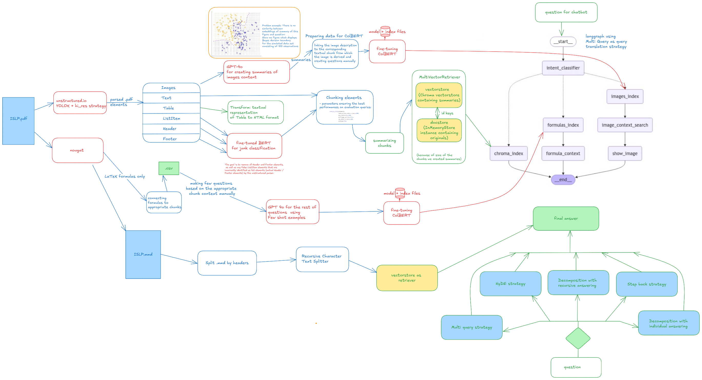

# ISLP RAG ChatBot App

## Description
Chat with Introduction to statistical learning in Python textbook. 

In the first input field designated for the user query, the user can choose a retriever based on how the .pdf document has been parsed. 
This can be either a **nougat parser** or an **unstructured .pdf parser**. 
* If the user selects the nougat parser, a **vector store** is created as the retriever;
* if the unstructured parser is chosen, a **MultiVectorRetriever** is created.

The user can select a **method for transforming the original query** from five available options: 
1. Step Back
2. Multiquery
3. Recursive Decomposition
4. Query Decomposition (Individual Answers)
5. HyDE Chain.

In the **first input field**, the user can receive responses in the form of **text, tables, Python code, and formulas** from the selected book by pressing the button *"Get Answer using selected Query Translation Method and retriever."*
By asking a question **in the second input field**, the user query is transformed using the **Multi Query strategy**, and an instance of **MultiVectorRetriever** is employed; however, this time the user can also perform **image searches** besides mentioned operations.

This is an example of asking Chatbot for specific image:

This is an example of asking for specific formula:

This is an example of asking for partition of Python code.

This is an example of asking for table output:

## Architecture

